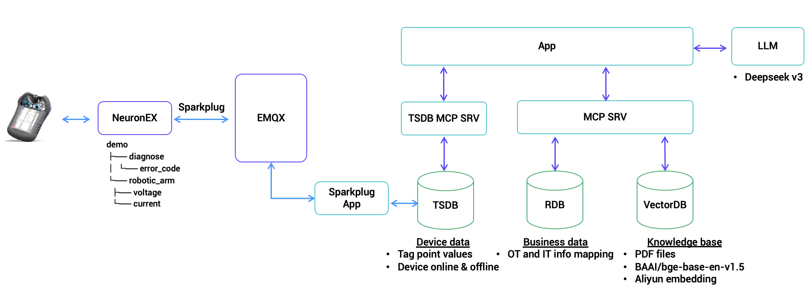

## Overview

This project demonstrates a Sparkplug B (SPB) implementation featuring a chat-based interface for industrial IoT monitoring and control. It combines a Sparkplug MCP server with a web application that allows users to query device data, analyze historical metrics, and monitor device status through natural language interactions. The system supports both real-time monitoring and historical analysis of device metrics, making it ideal for industrial automation and IoT applications.

## Architect diagram


## Setup workspace

Follow the steps below to set up and run the application:

1. Clone the Repository
```bash
git clone https://github.com/emqx/spb-demo/
cd spb-demo
```

2. The project use `uv` to manage libs and project, please install [uv](https://docs.astral.sh/uv/getting-started/installation/) before getting start.

3. Some dependencies need to be compiled through cmake, please install [cmake](https://cmake.org/download/) before getting start.

4. Install Dependencies and Activate Virtual Environment
```bash
uv sync
uv venv
```

## Pre-conditions
### Install software and configurations
Please refer to [software preparation](docs/software.md).

## Run the application
**Steps**
- Copy `.env.example` to `.env` and modify the values accordingly.
- Run sparkplug mcp server
```bash
  uv run spb_server.py
```
- Run biz mcp server
```bash
  uv run biz_app.py
```
- Run main application
```bash
  uv run main.py
```
- Open http://localhost:8000/ in browser.
- Type questions in the chatbox.

## Demos

**Demo scenario**
- 列出 demo 的树形结构图
- 查询设备 demo 最新的 robotic_arm/voltage 点位数据
- 分析过去一周设备 demo 的 robotic_arm/voltage 点位数据
- 查询设备别名为擎天柱的最新的 robotic_arm/amber 点位数据
- 查询设备 demo 最新的 diagnose/error_code 点位数据
- 分析过去一天设备 demo 的 diagnose/error_code 点位数据

**To be supported**
- 查询过去一周节点 assembly_1 的离线情况
- 总结一下过去一周 factory_1 组下节点名称为 assembly_1 下的 test 设备点位 group2/voltage 的工作情况 